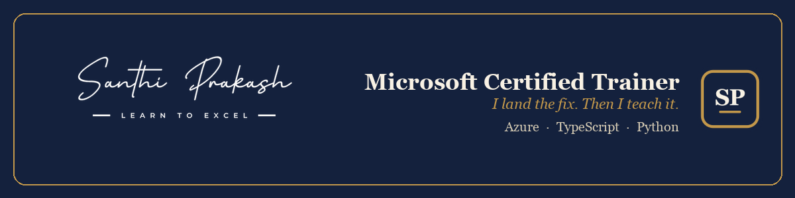

[Website](https://santhiprakash.com) ·
[LinkedIn](https://linkedin.com/in/santhiprakashb) ·
[YouTube](https://www.youtube.com/@santhiprakashb) ·
[Email](mailto:connect@santhiprakash.com)

I build AI workflows, developer tools, and resilient cloud systems that survive
contact with production. My everyday toolkit includes TypeScript, Python,
Azure, Postgres, and LLMs. I also share what I learn through practical,
build-first sessions.

## Selected open-source work

- [**Reactive Resume #3387**](https://github.com/reactive-resume/reactive-resume/pull/3387)
  — repaired form-control label and accessibility contracts, with regression
  coverage.
- [**Beszel #2269**](https://github.com/henrygd/beszel/pull/2269)
  — corrected GPU chart layout behaviour and worked through maintainer review
  to merge.
- [**HyperFrames #3387**](https://github.com/heygen-com/hyperframes/pull/3387)
  — surfaced every tried path in missing-manifest errors, across producer and
  CLI.

I also contribute to [Remotion](https://github.com/remotion-dev/remotion),
[OpenMausBot](https://github.com/milind-soni/OpenMausBot),
[OpenShip](https://github.com/oblien/openship),
[OpenClaw](https://github.com/openclaw/openclaw), and
[Prettier](https://github.com/prettier/prettier).

Explore the pinned projects below, or
<a href="mailto:connect@santhiprakash.com">get in touch</a>.

