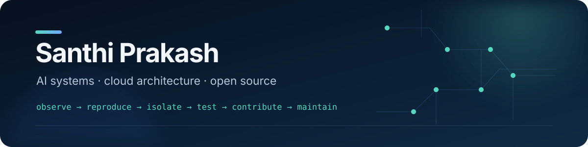

I build AI workflows, developer tools, and resilient cloud systems that survive
contact with production. My stack is usually TypeScript, Python, Azure,
Postgres, and LLMs—and I teach the lessons through practical, build-first
sessions.

## Open-source footprint

Selected by a combination of project reach and accepted work. Counts cover all
PRs submitted from this account and are a snapshot from **6 September 2026**.

| Project | What it builds | Contributions |
|:--|:--|:--:|
| [**Remotion**](https://github.com/remotion-dev/remotion) | Programmatic video with React |   |
| [**OpenClaw**](https://github.com/openclaw/openclaw) | Cross-platform personal AI |   |
| [**OpenShip**](https://github.com/oblien/openship) | Self-hosted deployment platform |   |
| [**Prettier**](https://github.com/prettier/prettier) | Opinionated code formatting |   |
| [**OpenMausBot**](https://github.com/milind-soni/OpenMausBot) | Open-source agentic bot |   |
| [**Reactive Resume**](https://github.com/amruthpillai/reactive-resume) | Privacy-first resume builder |   |
| [**HyperFrames**](https://github.com/heygen-com/hyperframes) | HTML-to-video tooling for agents |   |

“Merged” means GitHub reports the PR as merged. Closed or superseded work is
not presented as accepted impact. Totals were verified through GitHub's search
API.

## A few contributions I’m proud of

- [**Reactive Resume #3387**](https://github.com/amruthpillai/reactive-resume/pull/3387) — repaired form-control label and accessibility contracts with regression coverage.
- [**Beszel #2269**](https://github.com/henrygd/beszel/pull/2269) — corrected GPU chart layout behavior and worked through maintainer feedback to merge.
- [**HyperFrames #3387**](https://github.com/heygen-com/hyperframes/pull/3387) — improved missing-manifest diagnostics across producer and CLI paths.
- [**Prometheus docs #3079**](https://github.com/prometheus/docs/pull/3079) — fixed CI link validation while keeping the final change narrowly scoped.

## Systems I build

| [Shopmatic](https://github.com/santhiprakash/shopmatic) | [FreshLane](https://github.com/santhiprakash/freshlane) | [RestroMenu](https://github.com/santhiprakash/restromenu) |
|:--|:--|:--|
| Storefront infrastructure for creators and affiliate marketers. | A neighborhood commerce experience built with Next.js. | Practical restaurant menu cards with PDF and PNG export. |
| [**View source →**](https://github.com/santhiprakash/shopmatic) | [**View source →**](https://github.com/santhiprakash/freshlane) | [**View source →**](https://github.com/santhiprakash/restromenu) |

## How I work

I use supervised AI workflows for research, reproduction, testing, and review
monitoring. I remain responsible for selecting the work, validating the actual
production path, submitting the change, and every maintainer conversation.

> A green test is evidence, not permission. A contribution should also fit the
> project’s policy, solve the reporter’s real problem, and be worth a
> maintainer’s attention.

**Current focus:** reliable agent workflows · developer tooling · Azure cloud
architecture · practical AI education

### Build something useful with me

[**santhiprakash.com**](https://santhiprakash.com) · [**connect@santhiprakash.com**](mailto:connect@santhiprakash.com)

